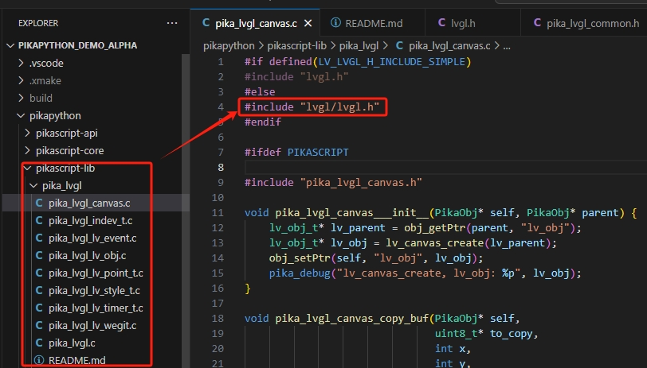

# lv_binding_pikapython_xmake

基于windows(mingw)+xmake 构建PikaPython 并绑定lvgl.

构建演示：

Note:

1. 执行xmake pikaPackage 会重新拉去包，其中lvgl 的包，默认引用lvgl 的头文件格式是 ../../lvgl.h ,而该工程是本地构建的lvgl 库，头文件路径是lvgl/lvgl.h ，如果重新pull了，需要手动修改下，否则编译报错

3. PikaPython lvgl 包的.c 文件 通过PIKASCRIPT 宏控制代码使用启用，默认不启用，需要手动定义这个宏,否则编译也会报错

